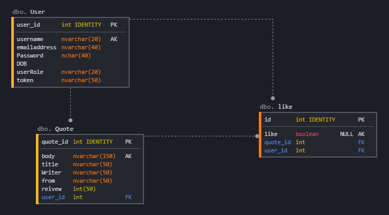

## **ADAB** Application: 
**ADAB** is a web application that allows the user to **sign up** and **log in** to the website to perform the **CRUD** functionalities which are **adding**, **editing**, **deleting**, and **viewing** the details of **Quotes**. User can **like quotes**, view the **most liked** quotes of **ADAB** website. User can **reset the password** when forget the password. The app uses **JWT** for **authentication** and **authorization**. 

###  **Front End** repository:
The Git repository of ADAB's Frontend:  [here](https://git.generalassemb.ly/ghaidhusall/ADABfrontend).

### **Deployed** sites:
* **Front end**: 
[here](https://pages.git.generalassemb.ly/ghaidhusall/ADABfrontend/).
* **Back end**: 
[here](http://adab-env.eba-nafjbdmq.us-east-2.elasticbeanstalk.com).

### **Technologies** used: 
**ADAB** used a number of technologies:
* Java, **Spring Boot**
* Server, **Apache Tomcat**
* RESTful **APIs**
* **MySQL** Database
* **AWS**, to deploy the web application
* **GitHub**, group project
* **Git Bash**

### **Entity–relationship** model
There are three tables in the database: **User**, **Quote**, **Liked**. 


### **Planning** documentation:
The planning documentation for **two weeks** to build **ADAB** website [here](Planing.jpg).

### Catalog of **Routes**:
| Verb        | URI Pattern           |
| ------------- |:-------------:| 
|POST     | /user/registration | 
| POST     | /user/authenticate      |   
| POST | /user/changepassword    |  
| POST | /user/resetpassword    |  
| POST | /user/forgotpassword    | 
| POST | /user/image/fileupload      |  
| GET | /user/profile     |  
| GET | /user/index      |  
| GET | /user/info     |  
| GET | /user/indexquote      |  
| PUT | /user/edit     |  
| DELETE | /user/delete    |   
____

| Verb        | URI Pattern           |
| ------------- |:-------------:| 
|POST     | /quote/add | 
| GET     | /quote/index      |   
| GET | /quote/detail    |  
| PUT | /quote/edit      |  
| DELETE | /quote/delete      |  
___
| Verb        | URI Pattern           |
| ------------- |:-------------:| 
|POST     | /liked/add | 
| GET     | /liked/islike      |   
| DELETE | /liked/delete      |  
___

### **Installation** Instructions:
#### System requirements: 
* Spring Boot, Build tool Maven
#### Servlet Containers:
* Tomcat v9
#### Creating the POM file 
* JPA dependency to accessing data:
```
<dependency>
            <groupId>org.springframework.boot</groupId>
            <artifactId>spring-boot-starter-data-jpa</artifactId>
        </dependency>
```
* MySQL dependency to connect database:
```
   <dependency>
            <groupId>mysql</groupId>
            <artifactId>mysql-connector-java</artifactId>
            <scope>runtime</scope>
        </dependency>
```
* Tomcat dependency:
```
    <dependency>
            <groupId>org.springframework.boot</groupId>
            <artifactId>spring-boot-starter-tomcat</artifactId>
            <scope>provided</scope>
        </dependency>
```
* Testing dependency:
```
    <dependency>
            <groupId>org.springframework.boot</groupId>
            <artifactId>spring-boot-starter-test</artifactId>
            <scope>test</scope>
        </dependency>
```
* Spring security dependency:
```
    <dependency>
            <groupId>org.springframework.security</groupId>
            <artifactId>spring-security-core</artifactId>
        </dependency>
```
* JSON Web Token (JWT) dependency:
```
<dependency>
			<groupId>io.jsonwebtoken</groupId>
			<artifactId>jjwt</artifactId>
			<version>0.9.1</version>
		</dependency>
```
### Future work and unsolved problems:
The user of **ADAB** will be able to follow friends and be a part of the community of adab lovers to share ,rate quotes and poems.
### Resources
*  **https://www.codejava.net/frameworks/spring-boot/spring-security-forgot-password-tutorial**

